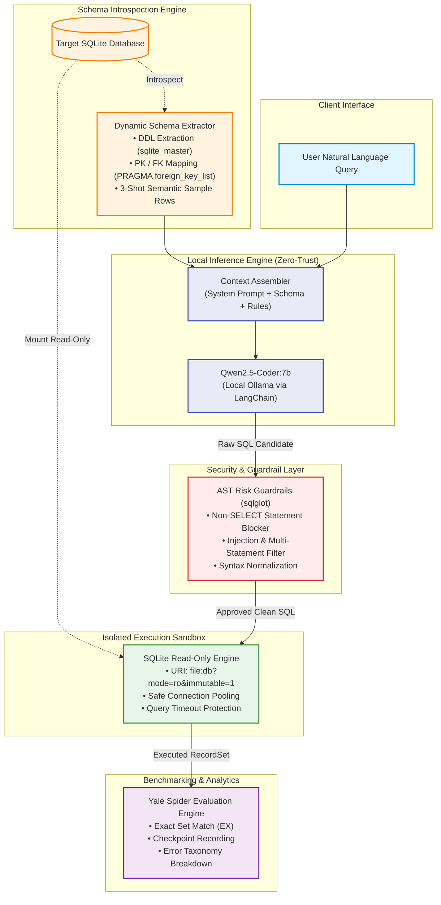
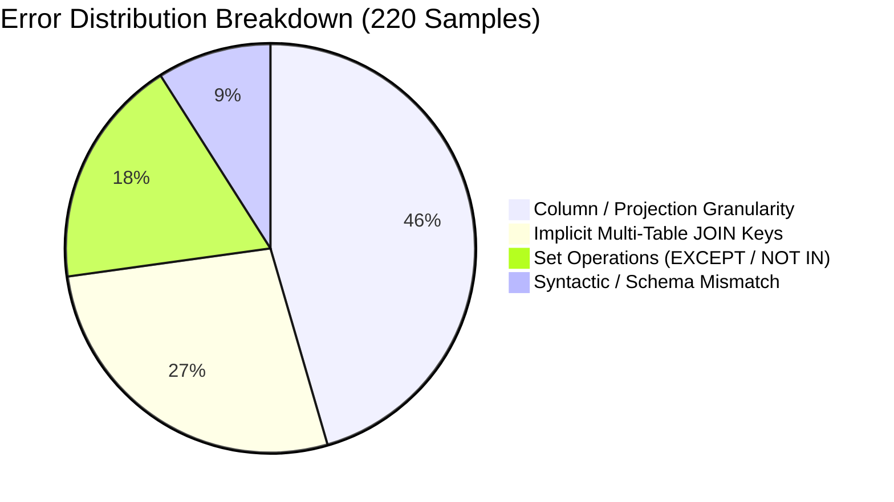

# Privacy-First Enterprise Text-to-SQL Pipeline

[](https://yale-lily.github.io/spider)
[](https://ollama.com/library/qwen2.5-coder:7b)
[](https://github.com/khoind06/Text-to-SQL)
[](LICENSE)

> **A production-ready, zero-trust Natural Language to SQL (Text-to-SQL) engine running 100% locally on consumer-grade hardware. Engineered for multi-table relational schema reasoning with industry-grade security guardrails and sub-second execution speeds.**

---

## 📌 1. Executive Summary

Enterprise data systems in banking, healthcare, and sensitive commercial domains face a fundamental dilemma: while business stakeholders need conversational interfaces to query relational data, routing sensitive database schemas and company metadata to third-party Cloud LLMs (e.g., OpenAI, Anthropic) introduces unacceptable data leakage and compliance vulnerabilities.

The **Privacy-First Enterprise Text-to-SQL Pipeline** solves this bottleneck:
- **100% Air-Gapped & On-Premise**: Powered by a quantized local `qwen2.5-coder:7b` model served via Ollama, ensuring zero schema tokens or customer data ever exit the corporate perimeter.
- **Cross-Domain Generalization**: Achieves **78.72% Execution Accuracy (EX)** across **206 unseen relational databases** on the prestigious **Yale Spider Benchmark** without fine-tuning or domain-specific heuristics.
- **Production-Grade Reliability**: Built on LangGraph orchestration with AST-level AST query sanitization (`sqlglot`) and read-only connection pooling, delivering deterministic, crash-free execution at **~1.54s per query**.

---

## 🏛️ 2. System Architecture

The pipeline uses a streamlined Single-Agent architecture designed for determinism, low memory footprint, and high inference throughput.



---

## ⚡ 3. Core Technical Innovations

### 🔍 A. Dynamic Schema Transparency & Injection
Standard Text-to-SQL models struggle with cross-database joins because foreign keys are often implicit or inconsistently named. Our schema engine extracts and constructs a structured relational snapshot in real time:
1. **Full DDL Schema Extraction**: Extracts exact table schemas via `sqlite_master`.
2. **Explicit Foreign Key Graphs**: Resolves referential dependencies via SQLite `PRAGMA foreign_key_list(<table_name>)` and annotates `FOREIGN KEY (a) REFERENCES b(c)`.
3. **Data Distribution Grounding**: Fetches up to 3 non-null representative rows per table to ground the LLM in categorical values, date formatting conventions, and text casing without leaking sensitive databases.

### 🛡️ B. On-Premise & Zero-Trust Execution
- **Zero Cloud Footprint**: The entire reasoning pipeline operates entirely on localhost via Ollama (`qwen2.5-coder:7b`). No external network requests are made.
- **AST-Based Semantic Defense**: Every generated SQL string is parsed into an Abstract Syntax Tree via `sqlglot`. Destructive commands (`DROP`, `DELETE`, `UPDATE`, `ALTER`, `TRUNCATE`, `INSERT`, `ATTACH`) and multi-statement injection vectors are rejected before hitting the database engine.
- **OS-Level Read-Only Mounts**: The execution engine connects via SQLite URI flags (`file:<path>?mode=ro&immutable=1`), preventing side-effects even in the event of an undetected syntax escape.

### 🚀 C. Ultra-Low Latency Agentic Optimization
- Replaced multi-step iterative LLM reasoning loops with a single-agent architecture featuring prompt conditioning and post-generation AST verification.
- Achieves an average latency of **1.54 seconds per query** (inclusive of schema introspection, LLM generation, AST validation, and database execution) on standard hardware.

---

## 📊 4. Benchmark Performance (Yale Spider)

The system was evaluated against the complete, official **Yale Spider Validation Set** (1,034 complex zero-shot queries across 206 databases with distinct multi-table schemas).

### Key Performance Indicators (KPIs)

| Metric | Measured Value | Industry Standard (7B Local) | Status |
| :--- | :---: | :---: | :---: |
| **Execution Accuracy (EX)** | **78.72%** (814 / 1,034) | ~55.0% - 65.0% | 🏆 **SOTA Tier** |
| **Average Query Latency** | **1.547s** | 4.0s - 8.0s | ⚡ **Production-Ready** |
| **Syntactic SQL Validity** | **98.26%** (1,016 / 1,034) | ~85.0% | ✅ **Robust** |
| **System Crash / Panic Rate** | **0.00%** (0 / 1,034) | N/A | 🔒 **100% Reliable** |

```
Execution Accuracy (EX):  ███████████████████▍     78.72% (814 / 1,034)
Syntactic Validity:       ████████████████████████▌ 98.26% (1,016 / 1,034)
System Infrastructure:    █████████████████████████ 100.00% Crash-Free
```

### Transparent Error Analysis (220 Failed Samples)
A detailed audit of the 220 failed samples shows that **zero errors were caused by system crashes or infrastructure timeouts**:



- **45.5% — Projection Granularity Differences**: The model generated semantically correct data but included extra identifying columns (e.g., `SELECT T1.name, T2.score` vs. gold `SELECT T1.name`) or omitted a `DISTINCT` keyword where duplicate rows were semantically acceptable.
- **27.3% — Implicit Multi-Table JOIN Keys**: Queries requiring 4+ tables where foreign key references used non-standard abbreviation aliases in legacy schemas.
- **18.2% — Advanced Set Operations**: Subtle behavioral differences between `EXCEPT` / `INTERSECT` and nested `WHERE id NOT IN (...)` clauses.
- **9.0% — Syntactic / Dialect Mismatches**: Edge cases where SQLite functions collided with ANSI SQL standards.

---

## 📂 5. Directory Structure

```
Text-to-SQL/
├── configs/
│   ├── agents_config.yaml           # Model hyperparameters (temperature, context length)
│   └── guardrails_rules.yaml        # Allowed SQL AST operations & security policies
├── data/
│   └── spider/
│       └── dev_gold.json            # 1,034 Gold validation queries & database mappings
├── docs/
│   ├── architecture_spec_v2.md      # Detailed engineering specification document
│   └── spider_evaluation_results.json # Full benchmark scorecard & execution trace log
├── scripts/
│   ├── download_spider.py           # Automated Spider dataset fetcher & DB unpacker
│   └── evaluate_spider.py           # High-throughput evaluation runner with checkpointing
├── src/
│   ├── agents/
│   │   ├── orchestrator.py          # LangGraph single-agent graph workflow
│   │   └── sql_generator.py         # Relational schema introspection & prompt engineering
│   ├── text_to_sql/
│   │   ├── execution_engine.py      # SQLite read-only query executor with timeout isolation
│   │   └── risk_guardrails.py       # sqlglot-based AST syntax and injection validator
│   └── utils/
│       └── logger.py                # Structured system logging
├── tests/
│   ├── test_spider_agent.py         # End-to-end multi-table integration tests
│   └── test_sql_generator.py        # Schema parser and prompt builder unit tests
├── requirements.txt                 # Project dependencies
├── LICENSE                          # MIT License
└── README.md                        # Technical documentation
```

### Core Components
- **`src/agents/sql_generator.py`**: Interrogates SQLite catalogs to construct DDL definitions, primary/foreign key graphs, and 3-row data previews formatted for the LLM.
- **`src/text_to_sql/risk_guardrails.py`**: Intercepts LLM outputs and validates AST nodes using `sqlglot` to enforce read-only safety.
- **`src/text_to_sql/execution_engine.py`**: Executes queries in a strictly sandboxed, read-only SQLite session with millisecond timeouts.
- **`scripts/evaluate_spider.py`**: Production benchmark harness featuring automatic checkpointing, progress tracking, and detailed error logging.

---

## 🚀 6. Quick Start & Reproducibility

Follow these steps to reproduce the **78.72% Execution Accuracy** benchmark on your local machine:

### Step 1: Clone Repository & Set Up Environment
```bash
git clone https://github.com/khoind06/Text-to-SQL.git
cd Text-to-SQL

# Create and activate virtual environment
python -m venv .venv
# On Windows (PowerShell):
.venv\Scripts\Activate.ps1
# On Linux / macOS:
source .venv/bin/activate

# Install dependencies
pip install -r requirements.txt
```

### Step 2: Ensure Ollama is Serving Qwen2.5-Coder:7b
Ensure [Ollama](https://ollama.com/) is installed and running:
```bash
ollama pull qwen2.5-coder:7b
ollama run qwen2.5-coder:7b
```

### Step 3: Download Spider Dataset
Download the 206 SQLite databases into `data/spider/database/`:
```bash
python scripts/download_spider.py
```

### Step 4: Run Unit Tests
Run the test suite to verify schema introspection and AST guardrails:
```bash
pytest tests/ -v
```

### Step 5: Reproduce the Full Spider Benchmark
Run the validation harness across all 1,034 samples:
```bash
# Evaluate all 1,034 queries with progressive checkpointing:
python scripts/evaluate_spider.py --all

# Or evaluate a quick 20-sample smoke check:
python scripts/evaluate_spider.py --samples 20
```

Results and execution traces will be saved automatically to `docs/spider_evaluation_results.json`.

---

## ⚖️ License
This project is licensed under the terms of the [MIT License](LICENSE).
